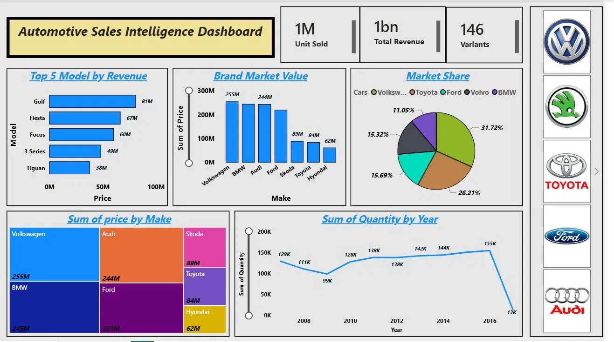

# Automotive Sales Intelligence Dashboard

## Overview
An end-to-end Power BI dashboard analyzing automotive sales data across 7 major brands, 
146 model variants, and 10 years of Norway market data (2007–2016).

## Dashboard Preview

## Data Sources
| File | Description | Rows |
|------|-------------|------|
| Norway_car_sales_by_make.csv | Monthly sales by brand, Norway 2007–2017 | 4,377 |
| cars_dataset.xlsx | UK car listings with price, mileage, fuel type | 72,435 |

## Key Insights
- Volkswagen leads Norway market share at 15.3% — dominant across entire decade
- Golf is the highest revenue model at £81M with 4,863 listings
- Audi & BMW command £22K+ avg price — nearly 2× Ford's £12.3K
- Norway sales grew 20% from 129K (2007) to 155K (2016)
- Petrol dominates fuel mix at 55.7%, Diesel at 39.9%, Hybrid under 5%

## Tools Used
- Power BI Desktop
- Microsoft Excel
- CSV / structured data

## Visuals Included
- Top 5 models by revenue (bar chart)
- Brand market value comparison (bar chart)
- Norway market share (pie chart)
- Units sold by year trend (line chart)
- Fuel type mix (donut chart)
- KPI cards — units sold, revenue, variants

## How to Open
1. Download `Automotive_Sales_Dashboard.pbix`
2. Open in Power BI Desktop
3. Refresh data if prompted

## Author
**Kapil Mali** | Data Analyst | Pune  
LinkedIn: https://www.linkedin.com/in/kapil-mali/ 
GitHub: https://github.com/Kapilmali07
